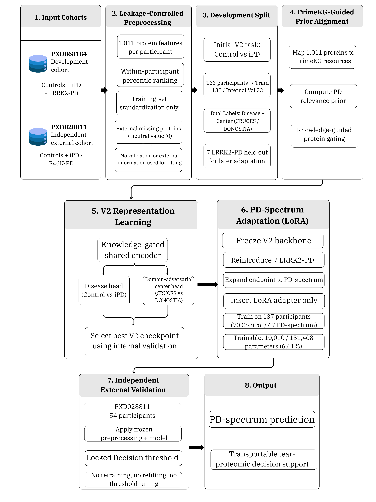
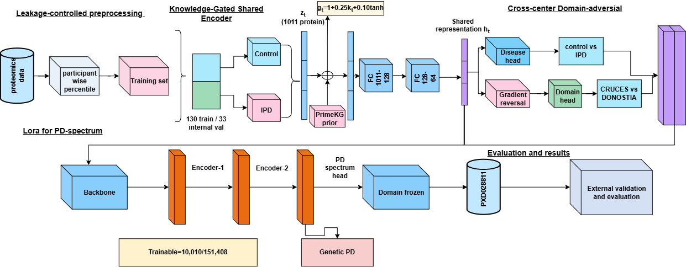
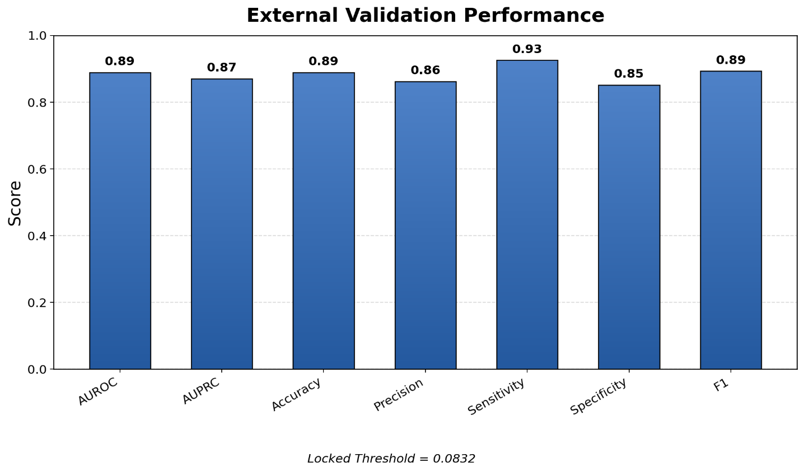
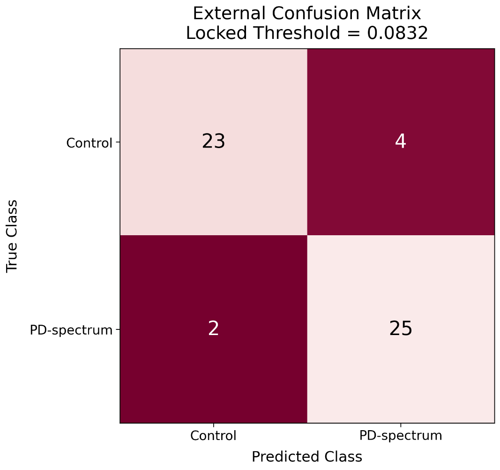

# Cross-Center Parkinson’s Disease Spectrum Detection from Tear Proteomics Using Knowledge-Guided Domain Adaptation and LoRA

A research implementation for **Parkinson’s disease (PD) spectrum detection from tear-fluid proteomics** using biological prior knowledge, cross-center domain-adversarial representation learning, and parameter-efficient **Low-Rank Adaptation (LoRA)**.

The framework is designed to learn disease-relevant molecular representations while reducing acquisition-center dependence and preserving external transportability across independent cohorts.

---

## Overview

The proposed pipeline combines:

- **Tear-fluid proteomics** with 1,011 protein-level features
- **PrimeKG-guided biological prior information**
- A **knowledge-gated shared molecular encoder**
- **Domain-adversarial learning** across the CRUCES and DONOSTIA acquisition centers
- **Low-Rank Adaptation (LoRA)** for parameter-efficient PD-spectrum refinement
- **Leakage-controlled preprocessing**
- **Locked external validation** on an independent cohort without retraining or threshold recalibration

The model is first trained on the PXD068184 development cohort and then evaluated on the independent **PXD028811** cohort.

---

## Framework Architecture

<p align="center">
  
</p>

The architecture integrates preprocessing, PrimeKG-guided molecular information, shared representation learning, cross-center domain adaptation, LoRA-based refinement, and independent external validation.

---

## End-to-End Experimental Pipeline

<p align="center">
  
</p>

The complete experimental workflow separates model development from the external evaluation stage to reduce information leakage and provide a stricter test of transportability.

---

## Datasets

### PXD068184 — Development Cohort

PXD068184 is used as the primary development cohort.

For the initial V2 representation-learning stage:

- **130 participants** were used for training
- **33 participants** were retained for internal validation
- CRUCES and DONOSTIA were treated as separate acquisition domains
- Genetic PD cases were withheld during the initial representation-learning stage

After V2 training, **7 LRRK2-associated PD cases** were added to the training branch for PD-spectrum LoRA adaptation.

The final LoRA training cohort contained:

- **70 controls**
- **67 PD-spectrum cases**
- **137 participants in total**

### PXD028811 — Independent External Cohort

The final model was evaluated on PXD028811 as an independent external cohort:

- **27 controls**
- **27 PD-spectrum cases**
- **54 participants in total**

No external retraining, normalization refitting, feature reselection, center adaptation, LoRA modification, or threshold optimization was performed.

---

## Methodology

### 1. Leakage-Controlled Preprocessing

Protein abundance values are transformed using a participant-wise percentile-rank procedure. Standardization parameters are estimated only from the original development-training subset and are reused unchanged for validation, genetic PD samples, and external inference.

### 2. PrimeKG-Guided Molecular Prior

The 1,011 proteomic features are aligned with PD-related biological information derived from **PrimeKG**. A compact disease-relevance prior is used to guide the contribution of individual proteins.

### 3. Knowledge-Gated Shared Encoder

The gated proteomic representation is compressed through a shared neural encoder:

```text
1011 -> 128 -> 64
```

The resulting 64-dimensional representation is shared by the disease classifier and the domain-adversarial branch.

### 4. Cross-Center Domain Adaptation

A gradient-reversal-based domain classifier is used to reduce acquisition-center information in the learned molecular representation while maintaining disease discrimination.

The two modeled acquisition domains are:

- CRUCES
- DONOSTIA

### 5. PD-Spectrum LoRA Adaptation

After V2 backbone training, the backbone is frozen and the disease endpoint is expanded to the broader PD spectrum.

Only LoRA adapter parameters are optimized:

| Parameter Category | Parameters | Percentage |
|---|---:|---:|
| Frozen V2 parameters | 141,398 | 93.39% |
| Trainable LoRA parameters | 10,010 | 6.61% |
| Total parameters | 151,408 | 100% |

---

## Key Results

### Internal Validation

| Metric | Performance |
|---|---:|
| AUROC | **0.908** |
| AUPRC | **0.877** |
| Accuracy | **0.909** |
| Precision | **0.933** |
| Recall / Sensitivity | **0.875** |
| Specificity | **0.941** |
| Balanced Accuracy | **0.908** |
| F1 Score | **0.903** |

### Cross-Center Performance

- **CRUCES AUROC:** 0.930
- **DONOSTIA AUROC:** 0.881

### Independent External Validation

<p align="center">
  
</p>

| Metric | External Performance |
|---|---:|
| AUROC | **0.890** |
| AUPRC | **0.870** |
| Accuracy | **0.889** |
| Balanced Accuracy | **0.889** |
| Precision | **0.862** |
| Sensitivity | **0.926** |
| Specificity | **0.852** |
| F1 Score | **0.893** |
| Locked Decision Threshold | **0.0832** |

The model correctly classified **48 of 54 external participants**.

---

## External Confusion Matrix

<p align="center">
  
</p>

The external evaluation produced:

- **23 true negatives**
- **25 true positives**
- **4 false positives**
- **2 false negatives**

---

## Ablation Study

| Model Configuration | AUROC | Accuracy | F1 |
|---|---:|---:|---:|
| Baseline Simple Encoder | 0.7250 | 0.7300 | 0.7150 |
| Baseline + KG | 0.7820 | 0.7910 | 0.7840 |
| Baseline + DA | 0.7640 | 0.7700 | 0.7580 |
| Baseline + KG + DA | 0.8410 | 0.8520 | 0.8450 |
| **Proposed Framework** | **0.9080** | **0.9090** | **0.9030** |

---

## Installation

```bash
git clone https://github.com/machinelearning1910-cpu/parkinson-by-tears.git
cd parkinson-by-tears
python -m venv .venv
```

### Windows

```bash
.venv\Scripts\activate
```

### Linux / macOS

```bash
source .venv/bin/activate
```

Install dependencies:

```bash
pip install -r requirements.txt
```

---

## Experimental Environment

The experiments described in the paper were conducted using:

- Python
- PyTorch
- CUDA-enabled GPU environment
- NVIDIA L4 GPU
- NumPy
- Pandas
- Scikit-learn
- Joblib
- Matplotlib
- Google Colab
- Fixed random seed: **2026**

---

## Repository Structure

```text
.
├── README.md
├── requirements.txt
├── figures/
│   ├── framework_architecture.png
│   ├── experimental_pipeline.png
│   ├── external_validation_performance.png
│   └── external_confusion_matrix.png
├── Results/
├── PARKINSONS _dataset_download_and_audit.py
├── PARKINSONS _methodology_training.py
└── PARKINSONS _evaluation_and_results.py
```

---

## Reproducibility Notes

To preserve the leakage-controlled design described in the study:

1. Fit preprocessing statistics only on the original development-training subset.
2. Reuse the frozen preprocessing transformation for internal validation, genetic PD samples, and external inference.
3. Do not use PXD028811 for feature selection, threshold optimization, model fitting, or normalization fitting.
4. Freeze the V2 backbone before PD-spectrum LoRA adaptation.
5. Keep the internally selected decision threshold fixed during external evaluation.

---

## README Figures

The following figures are used in the GitHub README:

| Paper Figure | Repository File | Why Include It? |
|---|---|---|
| **Figure 1** | `figures/framework_architecture.png` | Best high-level overview of the proposed method |
| **Figure 2** | `figures/experimental_pipeline.png` | Shows the complete experimental workflow |
| **Figure 18** | `figures/external_validation_performance.png` | Summarizes the independent external results |
| **Figure 19** | `figures/external_confusion_matrix.png` | Shows class-level external prediction behavior |

### Optional Figures

If you later upload additional figures to the same `figures/` folder, you can also include:

- **Figure 3** -> `figures/cohort_distribution.png`
- **Figure 13** -> `figures/lora_parameter_efficiency.png`
- **Figure 15** -> `figures/lora_auroc_training.png`
- **Figure 16** -> `figures/lora_auprc_training.png`

For a clean GitHub page, the main README preferably uses only Figures **1, 2, 18, and 19**.

---

## Citation

If you use this repository or framework in academic work, please cite the associated manuscript.

```bibtex
@article{parkinson_tear_proteomics,
  title   = {Cross-Center Parkinson's Disease Spectrum Detection from Tear Proteomics Using Knowledge-Guided Domain Adaptation and LoRA},
  author  = {Add manuscript authors here},
  journal = {Add journal information here},
  year    = {2026}
}
```

Replace the placeholder author and publication information after the manuscript metadata is finalized.

---

## Disclaimer

This repository represents a research and proof-of-concept machine-learning framework. It is **not intended for clinical diagnosis or direct medical decision-making** without further prospective, multicenter, and clinical validation.
